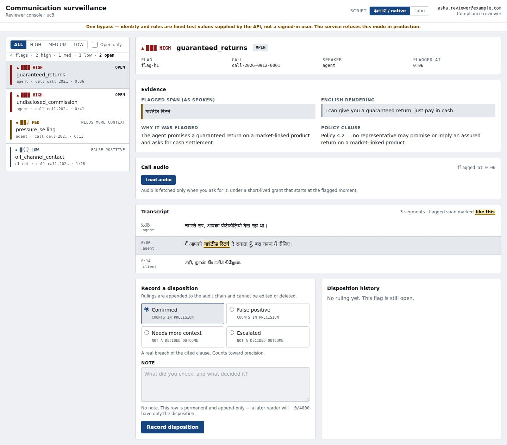
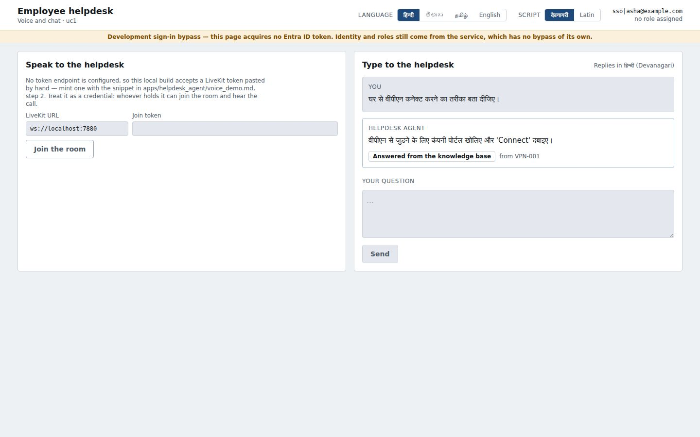
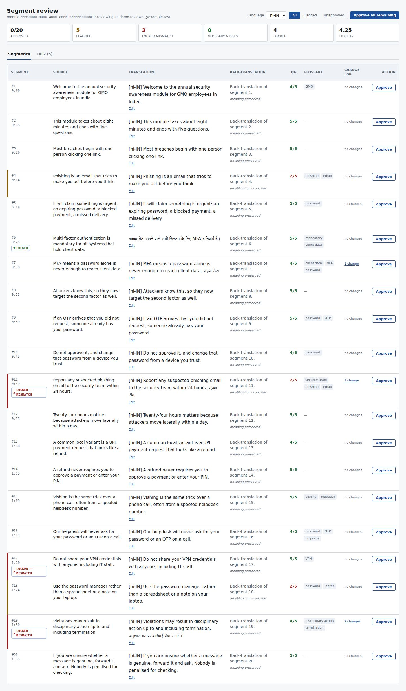
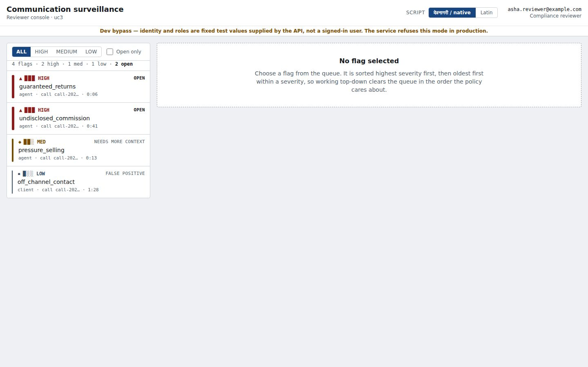
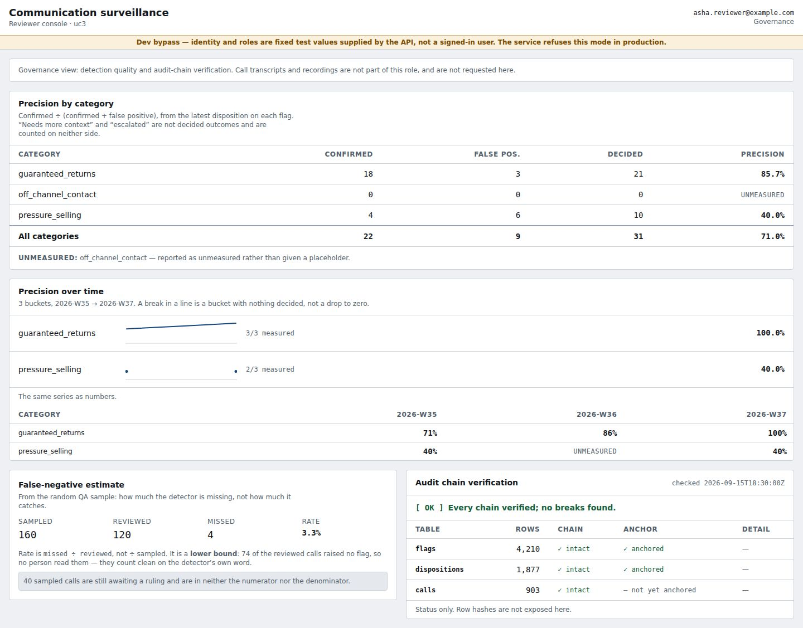

# Indic AI Platform

**Three Indian-language AI applications on one shared platform.**

A multilingual employee helpdesk, a training-video localizer and a communication-surveillance
console — each a FastAPI service with a React console, all three built on one Python platform
that owns the vendor adapters, the spend ledger, the evaluation harness and the observability.
Speech and translation come from [Sarvam](https://www.sarvam.ai/) (India-hosted); reasoning
comes from [Claude](https://www.anthropic.com/). Everything else is open source.

Hindi, Telugu and Tamil throughout — in the user's own script, not transliterated into English
and back.



> **This is a proof of concept, and one that has never run end to end.** The three container
> images build in CI and the compose stack is defined, but no one has yet started it: `make up`
> is unverified. Three of the eight quality gates that have been measured are failing, and UC1's
> have never been measured at all. The numbers are in
> [Measured quality](#measured-quality) below, unrounded. Read that section before showing this
> to anyone who will make a decision on it.

---

## Why it exists

Most "multilingual AI" is English AI with translation bolted to each end. A Hindi question is
translated to English, reasoned about in English, answered in English, and translated back. Two
extra vendor hops on the critical path, two chances to lose meaning, and a reply whose register
belongs to neither language.

This platform is built on three commitments instead.

**Reason in the user's language.** Claude reads and answers in Hindi, Telugu or Tamil directly
([ADR 0001](docs/adr/0001-reason-in-users-language.md)). Translation is used only where an
English artifact is genuinely required — rendering a flagged span for a compliance reviewer who
does not speak the language — never to route a conversation. That removed a vendor from the hot
path and about a third of UC1's variable cost.

**Untrusted text is data, never instruction.** Every utterance, transcript, document and script
is wrapped by `indic_platform.security.harden.wrap_untrusted` and labelled as data in the
prompt. The surveillance analysis calls run with **no tools at all**: a transcript is something
to be read, and a caller who says "ignore your instructions" is a person saying words on a
recording. Prompt-injection canaries are part of the golden set, not an afterthought.

**A number is measured or it is "unmeasured".** No gate is ever given a passing placeholder. A
category with no reviewer decision has `precision: null`, not `1.0`. Where a figure could not be
obtained, this repository says so — including in the table below, where it costs us.

---

## What it does

### Answer employee IT/HR questions, in the employee's language



An employee asks in Hindi, Telugu, Tamil or English, by chat or by voice, and is answered in the
language and script they used. Devanagari or Latin for Hindi is a per-user preference that
survives a reload. Answers are grounded in a retrieved knowledge base and carry the article they
came from; a grounding verifier re-checks the claim before the reply is shown, and a
deterministic guard node — no model in the loop — decides whether a ticket is filed.

Voice runs over LiveKit with Sarvam Saaras for speech-to-text and Bulbul for the reply. When a
vendor's circuit breaker opens, the app degrades deliberately: chat-only, or text-only, or
queue-the-ticket-and-template-the-reply, rather than failing.

### Localize a training module into three languages



A source module goes through five stages — adapt, translate, post-edit, back-translate QA, quiz
generation — and comes out as timed captions, dubbed audio and a comprehension quiz in Hindi,
Telugu and Tamil.

Terminology is the part that matters to a compliance team: a glossary can mark a term **LOCKED**,
and a locked mismatch cannot be bulk-approved. A reviewer has to look at it. Back-translation QA
scores every segment for fidelity against the source before a human sees it, so the review queue
is ordered by what is most likely wrong.

### Put a compliance reviewer in front of the calls that matter



Recorded client calls are transcribed with diarization, then passed through three stages: a
deterministic lexicon matcher, a cheap Haiku triage, and Sonnet deep analysis for what survives.
A verifier checks that every flag quotes a span that actually appears in the transcript, and
discards the ones that do not.

The reviewer sees the flagged phrase **as spoken**, an English rendering beside it, the reason,
and the policy clause — with the span marked inside the transcript, not merely quoted next to it.
Audio is fetched only on request, under a short-lived grant that starts at the flagged moment.

Every ruling is appended to a hash-chained audit trail that the application's database role
cannot `UPDATE` or `DELETE`, and a nightly job re-walks the chain and alerts on any break.



Roles are enforced server-side, not by hiding buttons. A governance reader gets aggregates and
the chain's health and is refused a transcript — and the refusal is rendered as an answer, not a
blank page. A refused caller never learns whether the flag id they asked for exists.

---

## Measured quality

Gates come from the PRD's B6 framework. These are the real numbers, most recently measured
2026-09-18 against live vendors.

| app | metric | measured | gate | |
|---|---|---|---|---|
| UC2 | semantic fidelity (mean, 90 items) | **4.13** | ≥ 4.0 | pass |
| UC2 | quiz validity (30 items) | **1.00** | — | pass |
| UC2 | terminology adherence (87 expectations) | **0.897** | 1.0 | **fail** |
| UC2 | timing fit (180 segments) | **0.400** | ≥ 0.90 | **fail** |
| UC3 | flag precision (242 flags, 74 labels) | **0.30** | ≥ 0.80 | **fail** |
| UC3 | recall | **0.986** | ≥ 0.85 | pass |
| UC3 | clean-call flag rate | **0.0** | — | pass |
| UC3 | Stage 0 lexicon gates | pass | — | pass, in CI on every PR |
| UC1 | every B6 gate | — | — | **never measured** |

What those failures mean, plainly:

- **UC3 flags too much inside calls that do contain something.** Recall is 0.986 and no clean
  call is flagged, so the detector is not crying wolf at random — it is over-flagging within
  calls that have a genuine issue. Roughly seven in ten flags a reviewer opens are wrong.
  Bringing this to the gate is `uc3/P9-precision`, and it must not be bought by trading recall.
- **UC2's terminology enforcement has a hole.** The post-edit stage was designed so this number
  could not fail — it enforces exactly what the scorer checks — and it does fail: nine
  mismatches survive post-edit, 26 of 37 total misses in a single module, worst in Tamil.
- **UC2 compression is not enough for dubbed timing.** The adapt stage nearly tripled timing fit
  (0.144 → 0.400) but is still less than half the target. The PRD's "shorten wording, not
  meaning" instruction is insufficient on its own.

Fidelity is scored against **draft** reference translations, and human correlation is unmeasured,
so 4.13 is weaker evidence than it looks.

---

## Running it

```bash
make bootstrap        # generate local stack credentials into .env.stack
make up               # build the three images and start everything
```

| | UC1 helpdesk | UC2 localizer | UC3 surveillance |
|---|---|---|---|
| API | `127.0.0.1:8001` | `127.0.0.1:8002` | `127.0.0.1:8003` |
| console | `/` | `/` | `/ui` |
| health | `/health` | `/health` | `/health` |
| metrics | `/metrics` | `/metrics` | `/metrics` |
| queue | `uc1` | `uc2` | `uc3` |

Each app gets its own API, its own Celery worker consuming its own queue, and — where it
schedules anything — its own beat. Prometheus scrapes the APIs *and* the workers, because that
is where the work happens: a spend refusal inside a task and the nightly audit-chain
verification are recorded nowhere else. Grafana is on `127.0.0.1:3001`, Prometheus on `:9090`.

UC3's queue starts empty — the ingestion pipeline that fills it is still to come. `make seed-uc3`
puts 48 calls in front of the reviewer console so there is something to look at, shaped from the
same golden set the evaluation scores. Every seeded row is labelled `demo-seed` and carries
`"demo": true`, so nothing in it can be mistaken for detector output.

Vendor keys come from the environment; `.env.example` lists every variable and `.env` is never
committed. Spend caps are per app, set at 2× each PRD's own estimate, and a refused call returns
`429` rather than a 500.

See [Services and full published port map](#services-and-full-published-port-map) for the rest of
the stack, and `docs/build/RUNBOOK.md` for the operating procedure.

---

## About the screenshots

They are real captures of the real consoles, taken by the Playwright suites in
`apps/*/ui/e2e/` and written to `docs/build/screenshots/`. Regenerate them with:

```bash
cd apps/comms_surveillance/ui && npm run build && E2E=1 npm run e2e
```

The data in them is **fixture data**, stubbed at the network boundary so the flow can be driven
without a database or a vendor key — not a live backend. The yellow banner visible in several
shots is the development sign-in bypass saying so; the service refuses that mode in production.
UC2's specs drive a live API instead, so its screenshots come from a real running stack.

---

## What this does not do yet

- **It has never run end to end.** The images build in CI; nobody has started the stack.
- **UC3's queue is empty.** Nothing outside the tests writes `analysis_runs` or `flags` yet, so
  the console, the metrics and the audit chain all describe empty tables until
  `uc3/P8-pipeline` lands. The detector currently runs only in the evaluation harness.
- **UC2 cannot produce a real dub** from a cloud session: the Sarvam dubbing upload host is not
  on the network allowlist and `ffmpeg` is absent. The production chain also has no trigger yet
  (`uc2/P7-produce`).
- **No deployment.** `program/P10` puts this on an Azure VM with Key Vault; it has not run.
- **UC2 has never had a security pass.** UC1's and UC3's are in `docs/security/`.
- **No pilot data.** Every number above comes from synthetic golden sets and draft references.

Open blockers are tracked in [docs/build/BLOCKERS.md](docs/build/BLOCKERS.md) and the remaining
work in [docs/build/PROMPT-PLAN.md](docs/build/PROMPT-PLAN.md).

---

## Architecture decisions

Program-level decisions and their consequences are recorded as ADRs, indexed in
[docs/adr/README.md](docs/adr/README.md): reasoning in the user's language (0001), one platform
package behind three apps (0002), hybrid hardened detection for surveillance (0005), meeting
minutes as a separate consented module (0006), the build workflow (0007) and the cloud build
environment contract (0008). ADRs 0003 (dubbing contract) and 0004 (surveillance scope) are
reserved for the prompts and the governance gate that own them. `docs/prd-v2.md` is the
specification and is read-only; deviations from it are recorded as ADRs.

## Package and interfaces

Source lives in `platform/`; import it as `indic_platform` to avoid shadowing Python's
stdlib `platform`. Apps import vendor functionality only from these adapters.
See [contracts](platform/adapters/base.py) and [SDK verification](docs/adapter-verification.md).

| Contract | Concrete adapter | Methods |
|---|---|---|
| STT | `SarvamSTT` | `stream(audio, language="auto")`, `batch(audio_uri, language="auto", diarize=False)` |
| TTS | `SarvamTTS` | `stream(text_chunks, language, voice)`; REST convenience `speak(...)` |
| Translate | `SarvamTranslate` | `translate(text, source="auto", target, mode="formal")` |
| Dubbing | `SarvamDubbing` | `submit(video_uri, target_languages, voice_map)`, `status(job_id)`, `fetch(job_id)` |
| LLM | `Claude` | `structured(system, user, schema, model, cache_system=True)`, `stream_text(system, messages, model)`; constructor takes `redactor` and `wrapper` so an app can document an evidence-preserving override (PRD E9) |
| VectorStore | Protocol for UC1 retrieval | `search(vector, limit=3, filters=None)` |

Streaming Protocol methods return asynchronous iterators directly (declared with `def` in
Protocols, `async def` plus `yield` in implementations), avoiding an extra coroutine layer.
STT input is 16 kHz mono PCM16; streaming times are receive-window estimates because Saaras
streaming has no timestamps. TTS accepts whole sentences and yields MP3 frames. Batch media
must be materialized to a local path or `file://` URI; cloud-object fetching belongs to app
storage integration. Dubbing supports the SDK's single `voice_id` per job and rejects a
multi-voice map explicitly. It disables voice cloning. Poll intervals cap at 30s; STT batch
deadline is 600s. Submitted duration is used for estimated STT/dubbing billing, charged once
at successful start; it is not a vendor invoice reconciliation.

All adapters default to one shared process token bucket (1000 rpm with a one-request burst).
Inject `RedisTokenBucket` with a common account key into runtimes to share the limit across
Celery/app processes. Circuit breakers expose chat-only, text-only, and queue/template flags;
applications consume these flags when implementing their workflows. Stream retries occur
only before the first emitted output, preventing duplicated audio/text after partial delivery.
Batch request headers carry stable content-derived idempotency keys; vendor enforcement of
those headers has not been established, so durable application deduplication is still required.

## Services and full published port map

All bindings are on `127.0.0.1`; ranges below are inclusive. Container-internal ports remain
standard. Langfuse connects to `langfuse-postgres:5432` on the Compose network.

| Service | Host → container | Protocol |
|---|---|---|
| postgres (pgvector/PostgreSQL 16) | 15433 → 5432 | TCP |
| redis | 6380 → 6379 | TCP |
| qdrant | 6333 → 6333; 6334 → 6334 | TCP |
| minio | 9000 → 9000; 9001 → 9001 | TCP |
| livekit | 7880 → 7880; 7881 → 7881 | TCP |
| livekit | 50100–50120 → 50100–50120 | UDP |
| livekit-sip | 5060 → 5060 | TCP and UDP |
| livekit-sip | 50200–50220 → 50200–50220 | UDP |
| tei | 8080 → 80 | TCP |
| langfuse | 3002 → 3000 | TCP |
| grafana | 3001 → 3000 | TCP |
| prometheus | 9090 → 9090 | TCP |
| uc1-api (helpdesk agent) | 8001 → 8000 | TCP |
| uc2-api (training localizer) | 8002 → 8000 | TCP |
| uc3-api (comms surveillance) | 8003 → 8000 | TCP |
| uc1-worker · uc2-worker · uc3-worker | none (internal 9100, metrics) | TCP |
| uc1-beat · uc3-beat | none | — |
| langfuse-postgres | none (internal 5432) | TCP |
| langfuse-worker | none (internal 3030) | TCP |
| clickhouse | none (internal 8123/9000) | TCP |

`make logs` tails this project's services; no existing projects are stopped or reconfigured.
Prometheus scrapes itself, Qdrant, LiveKit, the three app APIs and the three Celery workers. `make ingest-kb` exits with an explicit
prerequisite message until the UC1 corpus/pipeline exists. `make voice-test` runs Sarvam's
live smoke; the command above runs both vendors.

## Running the product

`make up` builds the three app images and starts everything: the APIs, a Celery worker per
app and a beat for each app that schedules work. `make apps-up` starts just the apps and
their workers; `make images` builds the images without starting anything, which is what CI
does on every PR.

| | uc1 helpdesk | uc2 localizer | uc3 surveillance |
|---|---|---|---|
| API | http://127.0.0.1:8001 | http://127.0.0.1:8002 | http://127.0.0.1:8003 |
| UI | `/` | `/` | `/ui` |
| health | `/health` | `/health` | `/health` |
| metrics | `/metrics` | `/metrics` | `/metrics` |
| queue | `uc1` | `uc2` | `uc3` |
| beat | yes (retention) | none — nothing scheduled | yes (sweep, chain verify, retention) |

Each app publishes to its own queue and its worker consumes only that queue, so a UC3 sweep
of a night's recordings cannot sit in front of a UC1 ticket retry. uc3 serves its bundle at
`/ui` rather than `/` because a catch-all mount answers a method its API does not allow with
a StaticFiles 404 instead of the role refusal its tests pin — see the comment in
`apps/comms_surveillance/api.py`.

Metrics are scraped from the APIs *and* the workers, because the work happens in the
workers: a spend refusal inside a task, and the nightly uc3 audit-chain verification PRD E8
requires an alert on, are recorded nowhere else. Alert rules are in `infra/alerts.yaml`;
before P12 the repo had two dashboards and no rules, and a dashboard is something you look
at once you already know.

Spend caps are per app (`INDICAI_APP` selects them), derived from each PRD's own POC
estimate at the 2× factor B8 mandates. A refused call returns 429 from an API and stops the
task — and its chain — in a worker, rather than surfacing as a 500 or a crash.

## Evaluation and boundaries

Each offline eval target checks eight synthetic utility fixtures (100% evidence checking,
delimiter integrity, and redaction). These are not B6 application-quality or model-injection
scores. Full golden sets and B6 go/no-go measurements are P1/application work. See
[golden conventions](platform/eval/README.md).

P0 provides hardening primitives, metadata-only traces and configurable controls. It does
not implement app SSO, retention, audit-chain governance, per-session/day spend caps, or
cloud deployment. Those remain the relevant app/P7 work; this scaffold does not claim the
full F4 security checklist is complete.
